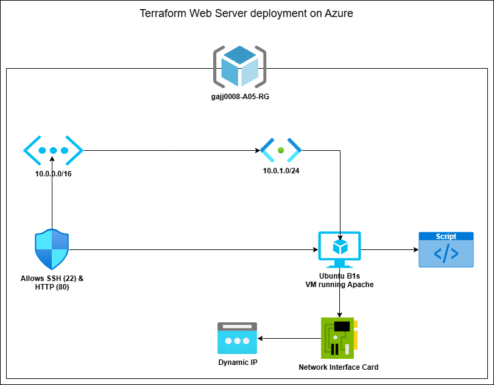

# LAB-A05 Terraform Web Server on Azure

## 🎯 Objective
Deploy a publicly accessible Apache web server on Azure using Terraform, following Infrastructure-as-Code (IaC) principles.

---

## 📋 Lab Steps

### 1. Create an Architecture Diagram
- **Tools**: Use [draw.io](https://app.diagrams.net/) or [Lucidchart](https://www.lucidchart.com/).
- **Components**:
  - Resource Group
  - Virtual Network (VNet): `10.0.0.0/16`
  - Subnet: `10.0.1.0/24`
  - Public IP Address
  - Network Security Group (NSG) with SSH (22) and HTTP (80) rules
  - Ubuntu VM with Apache installed via `cloud-init`
- **Sample Diagram**:
  